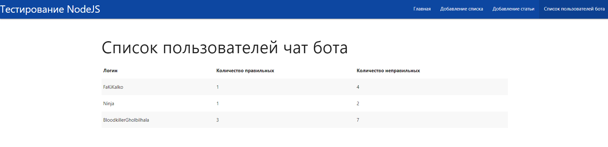

## Проект на NODE.JS с использование Mongo.db и шаблонизатора Handlebars, а так же APi-telegram

В данном примере реализовано простое приложение имеющая структуру MVC.
Model-и  лежат в папке models. View - views. Controller-ы - в папке routes.
Данное приложение не только работает с БД, но и управляет чат ботом в Telegram.
>__Пример страниц отображения:__
>
>
>
> >__Бот:__
>
>

